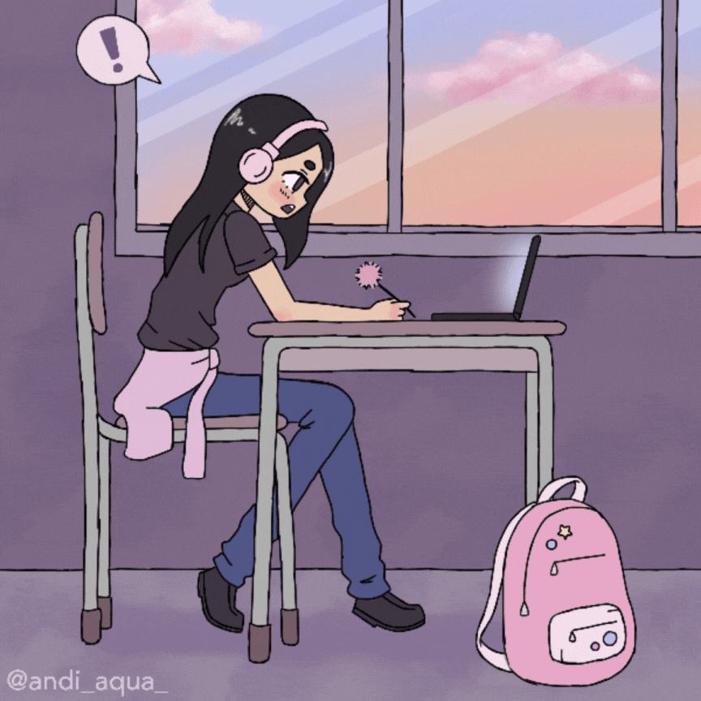

<!-- Container principal -->

  <!-- Coluna de texto + badges -->
  

    

    
    
Me chamo Julia Soares Pereira, tenho 19 anos de idade e atualmente curso o quarto semestre de Análise e Desenvolvimento de Sistemas na Fatec Prof. Jessen Vidal, em São José dos Campos (SP). Iniciei esse curso logo após concluir o Ensino Médio na Escola Walter Fortunato, e será minha primeira graduação na área da tecnologia. Sou proativa, gosto de aprender e estou sempre em busca de aprimorar minhas habilidades.

    

    

  
  

  

  <!-- Coluna do GIF -->
  

    
  

<!-- Linguagens e ferramentas -->
### 💻 Tecnologias e Ferramentas

  
  
  
  
  
  
  
  
  
  
  
  
  

<!-- Estatísticas -->
### 📈 Estatísticas

  

  

  

<picture align="center">
  <source media="(prefers-color-scheme: dark)" srcset="https://raw.githubusercontent.com/juliasoares17/juliasoares17/output/github-contribution-grid-snake-dark.svg">
  <source media="(prefers-color-scheme: light)" srcset="https://raw.githubusercontent.com/juliasoares17/juliasoares17/output/github-contribution-grid-snake-dark.svg">
  
</picture>

<!--
**juliasoares17/juliasoares17** is a ✨ _special_ ✨ repository because its `README.md` (this file) appears on your GitHub profile.

Here are some ideas to get you started:

- 🔭 I’m currently working on ...
- 🌱 I’m currently learning ...
- 👯 I’m looking to collaborate on ...
- 🤔 I’m looking for help with ...
- 💬 Ask me about ...
- 📫 How to reach me: ...
- 😄 Pronouns: ...
- ⚡ Fun fact: ...
-->
