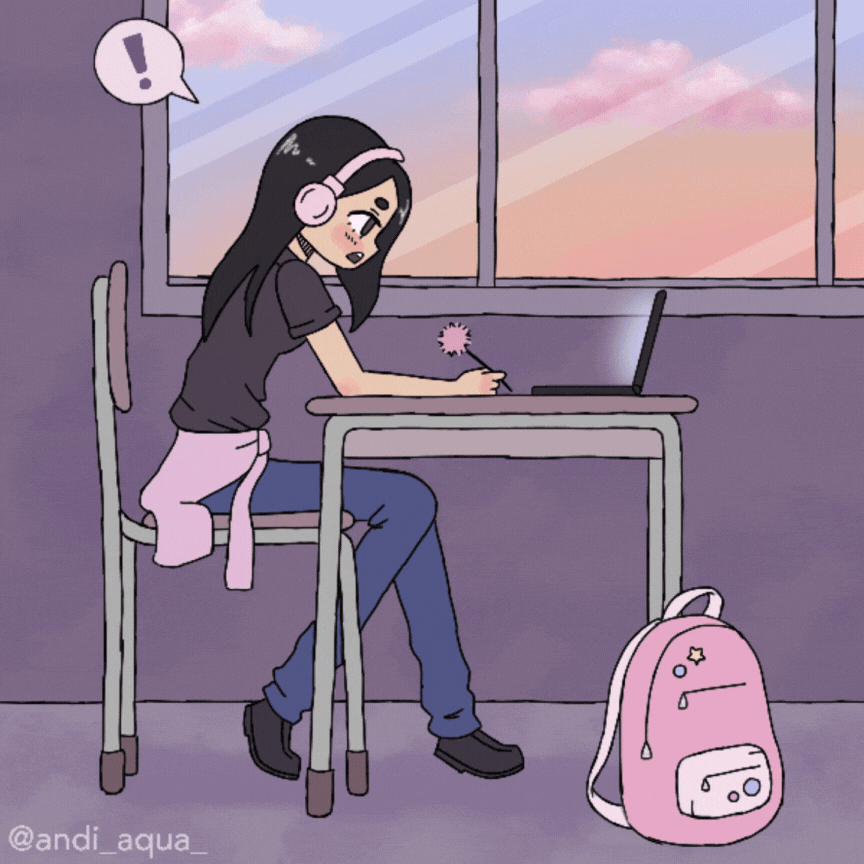

<!-- Seção principal: GIF à direita, texto + badges à esquerda -->
<table align="center" style="width:100%; max-width:800px;">
  <tr>
    <!-- Coluna de texto + badges -->
    <td style="vertical-align: top; padding-right: 1rem; width:30%;">
      <!-- Typing SVG -->
      
  <!-- Texto resumido -->
  

        Me chamo Julia Soares Pereira, tenho 19 anos e atualmente curso o quinto semestre de Análise e Desenvolvimento de Sistemas na Fatec Prof. Jessen Vidal, em São José dos Campos (SP). Iniciei esse curso logo após concluir o Ensino Médio na Escola Walter Fortunato, e será minha primeira graduação na área da tecnologia. Sou proativa, gosto de aprender e estou sempre em busca de aprimorar minhas habilidades.
      

       

  <!-- Badges -->
  

        
        
        
      

    </td>

  <!-- Coluna do GIF -->
  <td style="vertical-align: middle; text-align: center; width:70%;">
      
    </td>
  </tr>
</table>

<!-- Linguagens e ferramentas -->
## 💻 Tecnologias e Ferramentas

### Habilidades Principais:

### Ferramentas:

          

### Outros conhecimentos:

### Estudando atualmente:

  
  
  

 

<!-- Estatísticas -->

  <!--  -->
  
  <!--  -->

<picture align="center">
  <source media="(prefers-color-scheme: dark)" srcset="https://raw.githubusercontent.com/juliasoares17/juliasoares17/output/github-contribution-grid-snake-dark.svg">
  <source media="(prefers-color-scheme: light)" srcset="https://raw.githubusercontent.com/juliasoares17/juliasoares17/output/github-contribution-grid-snake-dark.svg">
  
</picture>

<!--
**juliasoares17/juliasoares17** is a ✨ _special_ ✨ repository because its `README.md` (this file) appears on your GitHub profile.

Here are some ideas to get you started:

- 🔭 I’m currently working on ...
- 🌱 I’m currently learning ...
- 👯 I’m looking to collaborate on ...
- 🤔 I’m looking for help with ...
- 💬 Ask me about ...
- 📫 How to reach me: ...
- 😄 Pronouns: ...
- ⚡ Fun fact: ...
-->
